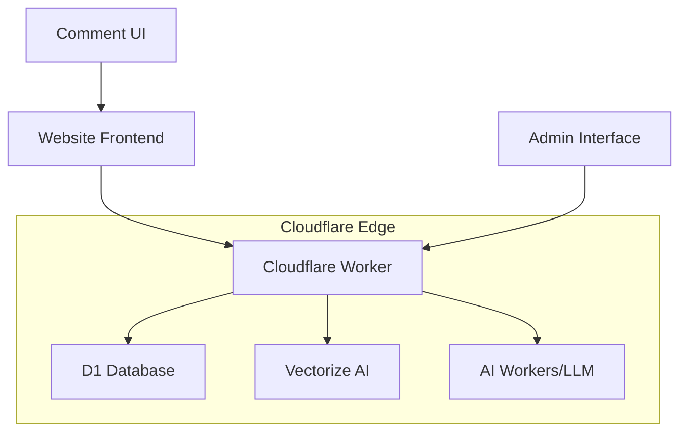

# Design Document

## Overview

The AI-powered comment system leverages Cloudflare's edge computing platform to deliver a fast, scalable commenting solution. The system uses Cloudflare Workers for serverless compute, D1 for SQLite-compatible database storage, and Vectorize for AI-powered semantic similarity. The architecture prioritizes performance, simplicity, and intelligent content organization while maintaining thread integrity.

## Architecture

### High-Level Architecture



### Component Overview

1. **Frontend Layer**: JavaScript-based comment interface embedded in web pages
2. **API Layer**: Cloudflare Worker handling all HTTP requests and business logic
3. **Data Layer**: D1 database for persistent storage with optimized schema
4. **AI Layer**: Vectorize for embeddings and optional LLM integration for content analysis
5. **Security Layer**: Built-in spam filtering and rate limiting

## Components and Interfaces

### Frontend Components

#### Comment Display Component
- Renders comment threads with proper nesting
- Handles AI-powered similarity grouping while preserving thread structure
- Provides responsive design for mobile and desktop

#### Comment Form Component
- Anonymous posting with optional name field
- Real-time validation and error handling
- Reply functionality with contextual threading

#### AI Ordering Interface
- Toggle between chronological and similarity-based ordering
- Visual indicators for topic groupings
- Smooth transitions between ordering modes

### Backend Components

#### Comment API Handler
```javascript
// Core API endpoints
POST /api/comments          // Create new comment
GET /api/comments/:pageId   // Retrieve comments for page
POST /api/comments/:id/reply // Reply to comment
GET /api/comments/similar   // Get similarity-ordered comments
```

#### Database Manager
- Handles D1 database operations
- Manages connection pooling and error recovery
- Implements data validation and sanitization

#### AI Similarity Engine
- Generates embeddings using Cloudflare Vectorize
- Calculates semantic similarity between comments
- Maintains thread integrity during reordering

#### Spam Filter Engine
- Multi-layer spam detection using pattern matching
- AI-powered content analysis for spam likelihood
- Rate limiting and IP-based restrictions

## Data Models

### Database Schema

```sql
-- Comments table
CREATE TABLE comments (
    id INTEGER PRIMARY KEY AUTOINCREMENT,
    page_id TEXT NOT NULL,
    parent_id INTEGER NULL,
    author_name TEXT DEFAULT 'Anonymous',
    content TEXT NOT NULL,
    content_hash TEXT NOT NULL,
    ip_address TEXT,
    created_at DATETIME DEFAULT CURRENT_TIMESTAMP,
    updated_at DATETIME DEFAULT CURRENT_TIMESTAMP,
    is_spam BOOLEAN DEFAULT FALSE,
    spam_score REAL DEFAULT 0.0,
    embedding_id TEXT NULL,
    FOREIGN KEY (parent_id) REFERENCES comments(id)
);

-- Indexes for performance
CREATE INDEX idx_comments_page_id ON comments(page_id);
CREATE INDEX idx_comments_parent_id ON comments(parent_id);
CREATE INDEX idx_comments_created_at ON comments(created_at);
CREATE INDEX idx_comments_content_hash ON comments(content_hash);

-- Rate limiting table
CREATE TABLE rate_limits (
    ip_address TEXT PRIMARY KEY,
    comment_count INTEGER DEFAULT 0,
    window_start DATETIME DEFAULT CURRENT_TIMESTAMP
);

-- Similarity cache table
CREATE TABLE similarity_cache (
    page_id TEXT,
    cache_key TEXT,
    ordered_comment_ids TEXT, -- JSON array
    created_at DATETIME DEFAULT CURRENT_TIMESTAMP,
    PRIMARY KEY (page_id, cache_key)
);
```

### Data Transfer Objects

```javascript
// Comment DTO
interface Comment {
    id: number;
    pageId: string;
    parentId?: number;
    authorName: string;
    content: string;
    createdAt: string;
    replies?: Comment[];
    similarityScore?: number;
}

// API Request/Response formats
interface CreateCommentRequest {
    pageId: string;
    parentId?: number;
    authorName?: string;
    content: string;
}

interface GetCommentsResponse {
    comments: Comment[];
    totalCount: number;
    orderingType: 'chronological' | 'similarity';
}
```

## Error Handling

### Client-Side Error Handling
- Form validation with immediate feedback
- Network error recovery with retry mechanisms
- Graceful degradation when AI features are unavailable

### Server-Side Error Handling
- Comprehensive input validation and sanitization
- Database connection error recovery
- AI service fallback strategies
- Structured error responses with appropriate HTTP status codes

### Error Response Format
```javascript
interface ErrorResponse {
    error: {
        code: string;
        message: string;
        details?: any;
    };
    timestamp: string;
}
```

## Testing Strategy

### Unit Testing
- Database operations and data validation
- Spam filtering algorithms
- AI similarity calculations
- API endpoint functionality

### Integration Testing
- End-to-end comment posting and retrieval
- AI embedding generation and similarity matching
- Rate limiting and spam prevention
- Cross-browser compatibility testing

### Performance Testing
- Load testing for concurrent comment submissions
- Database query optimization validation
- AI processing performance benchmarks
- Edge caching effectiveness

### Security Testing
- XSS prevention validation
- SQL injection protection
- Rate limiting effectiveness
- Input sanitization verification

## AI Implementation Strategy

### Embedding Generation
- Use Cloudflare Vectorize to generate embeddings for comment content
- Store embedding IDs in the database for efficient similarity queries
- Implement batch processing for multiple comments

### Similarity Calculation
- Calculate cosine similarity between comment embeddings
- Group comments by similarity threshold while preserving threads
- Cache similarity results to improve performance

### LLM Integration (Optional)
- Use Cloudflare AI Workers for content analysis
- Implement topic classification and spam detection
- Provide fallback mechanisms when LLM services are unavailable

## Deployment Configuration

### Cloudflare Worker Configuration
```javascript
// wrangler.toml
name = "comment-system"
main = "src/index.js"
compatibility_date = "2024-01-01"

[[d1_databases]]
binding = "DB"
database_name = "comments_db"
database_id = "your-database-id"

[[vectorize]]
binding = "VECTORIZE"
index_name = "comment_embeddings"

[vars]
ENVIRONMENT = "production"
MAX_COMMENT_LENGTH = "2000"
RATE_LIMIT_WINDOW = "60"
RATE_LIMIT_MAX = "5"
```

### Security Configuration
- CORS settings for cross-origin requests
- Content Security Policy headers
- Rate limiting configuration
- Input validation rules

This design provides a robust foundation for implementing the AI-powered comment system while maintaining simplicity and performance.