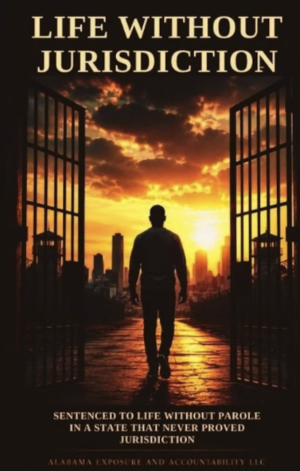

Have you noticed that when public officials are called out by social media that they start screaming how “you can’t believe social media”. Then use the same social media for self promotion as a denial platform.

Currently you may have noticed that the BCSO is running a social media vanity campaign to try and convince the general public that the sheriff office is hard at work protecting the public. The sheriff department, under Hoss Mack established total immunity for any of their officers for ANY of their actions. They have effectively blocked releasing any camera footage. It was Hoss Mack who requested 600,000 dollars for cameras to protect the citizens of Baldwin County. He promised in the presence of the County Commission that the camera footage was for public view as well as police. He bare faced lied then proceeded to expand Immunity coverage. To back up the" Baldwin County Sheriff Office Protection Plan" they use their own department to investigate themselves.

The BCSO has total immunity, no camera footage, no transparency, no accountability, investigate themselves and have a District Attorney licking one boot and a State Senator licking the other. BCSO has judges and lawyers who take BCSO actions as gospel. Mack developed a dangerous culture among the department that has been adopted by Anthony Lowery. In Baldwin County you can be innocent, not have a warrant, no gun and be shot dead by the sheriff department and most likely no court will investigate or find the guilty party responsible.



BCSO has done a good job snowing some of the general public but those of us who have paid close attention, see an entirely different picture.

Hoss Mack is now working to secure Tommy Tuberville as governor. He has his eye on heading Alabama League of Enforcement officers, ALEA. Electing a resident of another state as Governor
will secure the position he desires. INSANE

Mack and Lowery were principals in the wrongful conviction of Murray Lawrence Jr. Their motive was self promotion, they succeeded in the conviction of an innocent man. Lowery was lead investigator and he found not one shred of evidence.

    <a href="https://www.justiceformurraylawrencejr.com" rel="noopener noreferrer" target="_blank">
        
        <h2>
            Justice for Murray Lawrence Jr.
             
            www.justiceformurraylawrencejr.com
        </h2>
        
Wrongfully Convicted in Baldwin County Alabama. Read the book or listen to the audiobook here.

        Read More
    </a>

Please read the account of the wrongful conviction of Murray Lawrence in a book that will explain how deep the corruption runs in Baldwin County.

You can purchase the book at Page and Pallet Bookstore or order it online


