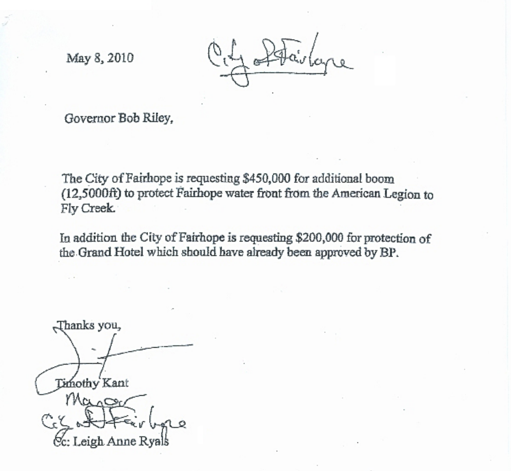

### New and Material Evidence in the Ongoing Fairhope BP Boom Scandal Investigation

**Cc:** Mobile FBI, Alabama Attorney General, Alabama Attorney General Special Prosecutor, Matt Hart, U.S. Attorney's Offices, Alabama, Alabama Ethics Commission, BP Fraud Division and all media.

**From:** F. Paul Ripp, Fairhope resident, 22985 High Ridge Road, Fairhope, AL 36532.

### Signed Statement:

Mayor Tim Kant and Senator Lee "Trip" Pittman continue to conspire with one another to cover up their questionable involvement in the Boom Grant Fraud Case. They have repeatedly lied to the general public, city council, city staff, city employees and authorities about what really happened.

On Monday, February 10, 2014 in a city council meeting during public participation, I presented a document to the council (attached below) and asked the Mayor, Timothy Kant, "Who signed this document?"

I also commented that the signature did not look like his. The mayor reluctantly explained that he had given an explanation on the matter to the previous council, stating that Leigh Anne Ryals, then Emergency Management Director for Baldwin County, "wrote the letter and he signed it." Two days later, on Wednesday February 12th, I contacted Mrs. Ryals by phone at her new office.

Mrs. Ryals categorically denied any involvement with the construction of the dubious letter, and further, stated that "she never dealt with Mayor Kant, only Senator "Trip" Pittman." To make myself emphatically clear, this means that:

**The Senator was acting as the mayor and presented documents that he manufactured and signed Kant's signature to, in as attempt to eliminate the previously incriminating documents. All this as an appointed trustee.**

Mayor Tim Kant insists that "he signed the letter" and if we take him at his word, then that means that he provided the cover letter to the second set of documents never revealed to the Fairhope City Council. Many of these allegations have been levied before. However, this is new material, just presented, and certainly reflects that the mayor and the senator are conspiring to cover-up their crime by implicating innocent people.

Multiple investigations and a grand jury have yet to provide us with the indictments obviously necessary. The delay of these indictments have only allowed further violations by the same people, as the new city council has insulated itself from any liability by claiming the Ethics Commission has approved the council giving the senator a debris removal contract after the subpoenas.

I respectfully ask that you fully investigate these matters and bring up appropriate impeachment charges against the Mayor of Fairhope. He has beguiled us for too long. Moreover, the mayor and the senator should immediately remove themselves from any board, commission or panel that has anything to do with BP funds.


