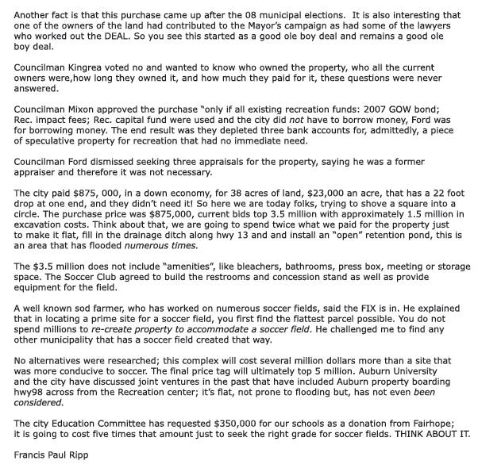

NEW SWEEP
The Ripp Report 2015
Feb. 8, 2015
The Ripp Report #30
LOCATION LOCATION TOTALLY LOCO LOCATIONS
The city of Fairhope has ignored its Comprehensive Plan, Master Plan, violated its own ordinances, recorded wrong plat maps, omitted public participation and made horrible decisions on the location of major venues in Fairhope.

Planning and zoning has been a black hole in our city finances, their decisions are made without any accountability, and they have no enforcement powers. This is the number one financial problem the city has faced for the last ten years.

Combine this problems with eliminating the Finance Committee as well as the Environmental and Tree Committee and you have the perfect storm for making horrible decisions affecting the city for years to come, and resulting in millions of dollars wasted.

Who's responsible? The Mayor. He continues to make decisions based on the good ole boy network primarily benefiting Arthur Corte and we are paying dearly.

LOCATION: the Publix shopping Center:
The Publix store "this is the first Publix store built where volumes of red clay had to be trucked in to elevate the property to accomodate a shopping center." Over 200 people protested the store location, The Environmental Committee, now disbanded, said it was a bad location and would most likely cause damage to the wetlands and Fly Creek, which is exactly what happened and continues to happen. The Woodlands sub-division was adamant that NO connectivity between them and Publix, no trail sidewalk, bridge of golf cart trail. The assessed damage to trees, determined by the now disbanded Tree Committee was $95,000. Our Mayor gave the land owner a pass on having to pay the fines assessed by the Tree Committee. This Good Ole Boy deal is going to cost is millions, the Corp of Engineers estimated the cost to clean out Fly Creek alone is over 2 million.

LOCATION: a Fire Station on a dead end street:
Fire station on a dead end road, this goes against common sense, ignoring many other reasons, such as safety; again the city ignores the obvious and allows the Mayor to promote yet another situation without researching any alternate locations. This is done without any public participation. The Fire department secured a loan from Community Bankfor $500,000 to build the station. The fire department is a nonprofit, what security did they have for a loan? Are they depending on Public donations or the assurance of our city council that they will donate? So you see they want your Money but do not want your input on a location that is the Mayor's decision and only benefits the developer: Arthur Corte.

LOCATION: Soccer Fields
In every case Location is determined by ownership and how the good ole boys can cash in. Long before a soccer field was discussed, Oct 2009, the sitting city council was talked into buying the property, in a down economy and no immediate need The property, on Manley road was one of two parcels available. The city choose to buy the worst possible parcel that has a 22 foot drop in elevation on the hwy 13 side running east to west. No intelligent person would ever consider it appropriate for a soccer field.

Mike Ford put together this purchase, insisting his being on the city council was not a conflict of interest and that he "wouldn't receive a penny." He claimed the same thing when he sold the county property to extend the satellite courthouse. A real estate agent that works for free and just happens to be on the council, how convenient is that? continued on page below

---PAGE BREAK---

Another fact is that this purchase came up after the 08 municipal elections. It is also interesting that one of the owners of the land had contributed to the Mayor's campaign as had some of the lawyers who worked out the DEAL. So you see this started as a good ole boy deal and remains a good ole boy deal.

Councilman Kingrea voted no and wanted to know who owned the property, who all the current owners were, how long they owned it, and how much they paid for it, these questions were never answered.

Councilman Mixon approved the purchase "only if all existing recreation funds: 2007 GOW bond; Rec. impact fees; Rec. capital fund were used and the city did not have to borrow money, Ford was for borrowing money. The end result was they depleted three bank accounts for, admittedly, a piece of speculative property for recreation that had no immediate need.

Councilman Ford dismissed seeking three appraisals for the property, saying he was a former appraiser and therefore it was not necessary.

The city paid $875,000, in a down economy, for 38 acres of land, $23,000 an acre, that has a 22 foot drop at one end, and they didn't need it! So here we are today folks, trying to shove a square into a circle. The purchase price was $875,000, current bids top 3.5 million with approximately 1.5 million in excavation costs. Think about that, we are going to spend twice what we paid for the property just to make it flat, fill in the drainage ditch along hwy 13 and install an "open" retention pond, this is an area that has flooded numerous times.

The $3.5 million does not include "amenities", like bleachers, bathrooms, press box, meeting or storage space. The Soccer Club agreed to build the restrooms and concession stand as well as provide equipment for the field.

A well known sod farmer, who has worked on numerous soccer fields, said the FIX is in. He explained that in locating a prime site for a soccer field, you first find the flattest parcel possible. You do not spend millions to re-create property to accommodate a soccer field. He challenged me to find any other municipality that has a soccer field created that way.

No alternatives were researched; this complex will cost several million dollars more than a site that was more conducive to soccer. The final price tag will ultimately top 5 million. Auburn University and the city have discussed joint ventures in the past that have included Auburn property boarding hwy98 across from the Recreation center; it's flat, not prone to flooding but, has not even been considered.

The city Education Committee has requested $350,000 for our schools as a donation from Fairhope; it is going to cost five times that amount just to seek the right grade for soccer fields. THINK ABOUT IT.

Francis Paul Ripp

---

