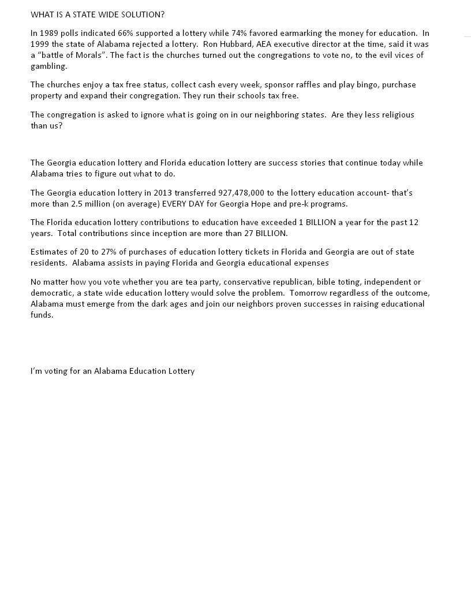

In 1989 polls indicated 66% supported a lottery while 74% favored earmarking the money for education. In 1999 the state of Alabama rejected a lottery. Ron Hubbard, AEA executive director at the time, said it was a “battle of Morals”. The fact is the churches turned out the congregations to vote no, to the evil vices of gambling.

The churches enjoy a tax free status, collect cash every week, sponsor raffles and play bingo, purchase property and expand their congregation. They run their schools tax free.

The congregation is asked to ignore what is going on in our neighboring states. Are they less religious than us?

The Georgia education lottery and Florida education lottery are success stories that continue today while Alabama tries to figure out what to do.

The Georgia education lottery in 2013 transferred 927,478,000 to the lottery education account- that’s more than 2.5 million (on average) EVERY DAY for Georgia Hope and pre-k programs.

The Florida education lottery contributions to education have exceeded 1 BILLION a year for the past 12 years. Total contributions since inception are more than 27 BILLION.

Estimates of 20 to 27% of purchases of education lottery tickets in Florida and Georgia are out of state residents. Alabama assists in paying Florida and Georgia educational expenses

No matter how you vote whether you are tea party, conservative republican, bible toting, independent or democratic, a state wide education lottery would solve the problem. Tomorrow regardless of the outcome, Alabama must emerge from the dark ages and join our neighbors proven successes in raising educational funds.

I’m voting for an Alabama Education Lottery

---

