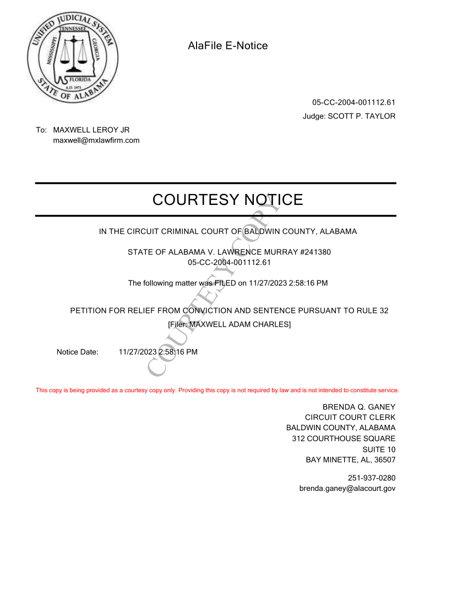

The wrongful conviction of Murray Lawrence has cost him over 7500 days in Jail. The Ripp Report is happy to announce that we are a step closer to Mr. Lawrence proving his innocence. A Rule 32 has been filed on his behalf.

A “Rule 32 petition” is a petition that people can file to challenge their conviction in court where they were convicted. It’s called a “Rule 32 petition” because it’s filed under Rule 32 of the Alabama Rules of Criminal Procedure. Generally speaking, someone would use a Rule 32 petition to attack their conviction once they’ve been convicted and once their appeals have gone final. A Rule 32 petition is how someone can get back into court.

<a style="text-align:center;display:block;margin-top:-26px;" href="./rule-32.pdf">Read Full Document</a>

<blockquote class="twitter-tweet">
<a href="https://t.co/5VBY7bPZG8">https://t.co/5VBY7bPZG8</a> Criminal rights advocates have unearthed a second autopsy of a 2003 murder that was never revealed during the trial of Murray “Bubba” Lawrence Jr., who was convicted and sentenced to life in prison without parole.
&mdash; RIPP REPORT (@RIPPREPORT) <a href="https://twitter.com/RIPPREPORT/status/1709620938478600420?ref_src=twsrc%5Etfw">October 4, 2023</a></blockquote>  

During the trial, Mack explained his involvement in more detail. 

> Primarily in this case at the first part of the case, (I) served as the coordinator for the sheriff's department coordinating our resources and our assistance with the Foley Police Department. Later in the case, I became more involved when I was asked to process certain items for fingerprints, to document a couple of areas of interest that were evaluated and ultimately conducting an interview with Jarius McNeil

he testified. 

Hoss the Boss was the “LEAD INVESTIGATOR”

<iframe src="https://www.facebook.com/plugins/post.php?href=https%3A%2F%2Fwww.facebook.com%2FTheRippReport%2Fposts%2Fpfbid02ubwoD39NLpGeKiikkL5Zkp3JuodXzCuxg3ryRvGK24ui2Js3D8wDzw49EG5GiTQVl&show_text=true&width=500" width="500" height="250" style="height:555px;border:none;overflow:hidden;max-width:99%;display:block;" scrolling="no" frameborder="0" allowfullscreen="true" allow="autoplay; clipboard-write; encrypted-media; picture-in-picture; web-share"></iframe>

The new evidence was “suppressed willfully rather than inadvertently” and was never divulged to the defense of Murray Lawrence. Mr. Lawrence has been incarcerated for 20 years. The evidence suppressed proves he was innocent. Sheriff Hoss, Mack District Attorney Robert Wilters who was the Judge, and David Whetstone the prosecutor, knowingly and willfully withheld the newly found evidence. Their signatures appear in the evidence. Not only does this prove Mr. Lawrence was innocent but it also supports allegations against authorities in previous cases alleging judicial misconduct.

The local Baldwin County press and Alabama independent internet journalists sites, have been reluctant, scared, to cover the blatant corruption of the Baldwin County Sheriff or any elected officials involved with this case. Only Lagniappe and the The Ripp Report as well as social media sites, facebook and blogs have been covering the wrongful conviction of Murray Lawrence who is being represented by Attorneys Maxwell/Tillman, Birmingham,Al.

Stay tuned for legal updates:

“The new evidence was 'suppressed willfully rather than inadvertently' and was never divulged to the defense of Murray Lawrence.”


